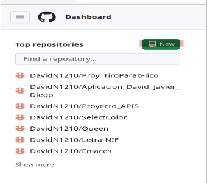
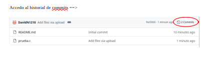
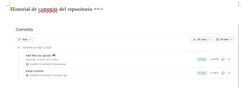

# Funciones de GitHub
**Autor:** David Nieto Heras
## Introducción
**GitHub** es una _plataforma web_ de alojamiento de código basada en la nube que permite a los desarrolladores almacenar, compartir y colaborar en proyectos de software utilizando el sistema de control de versiones Git.

En cuanto a sus **usos**, en GitHub podemos:
1. **Crear repositorios**: en GitHub podemos guardar nuestros proyectos atraves de los **repositorios**.
2. **Actualizar nuestro proyectos**: a traves de los COMMITS podemos ir confirmando los cambios y actualizando nuestros proyectos.
3. **Registrar los cambios**: en cada repositorio podemos acceder a historial un commits (todos los cambios realizados en el proyecto desde que se creo).
4. **Crear ramas y fusionarlas**: podemos crear varias ramas en nuestro repositorio. Estas ramas son utiles para la colaboración con otros usuarios o para trabajar en otra rama que no sea la principal. También podemos fusionar las ramas, introduciendo los cambios que hemos hecho en una rama a otra.
5. **Colaborar con otros usuarios**: podemos colaborar con otros usuarios y dejar que modifiquen nuestro repositorio o trabajar en un proyecto juntos (cada uno puede tener su propia rama y luego fusionarlas). 

## Pasos a seguir
### 1. Crear repositorios y guardar nuestros proyectos
Hago clic en NEW ==>  Le pongo el nombre al repositorio y lo inicializo con README ==> Hago _click_ en Create Repository ==> Repositorio creado 

      

Subo archivos al repositorio (Add File -> Upload Files) ==>  Arrastro el archivo y hago COMMIT ==>  Repositorio con los cambios realizados ==>  

      

### 2. Actualizar nuestros proyectos y acceder al registro de los cambios
Cada vez que hacemos un cambio en el repositorio hacemos un commit. Para acceder al historial de commits tenemos que hacer _click_ donde indica la imagen ==>  

Y ya podriamos ver el historial de commits ==>  

  

### 3. Crear y administrar ramas  
Para crear una rama tenemos que abrir la pestaña de las ramas y hacer _click_ en **View all branches** ==> En la nueva página pulsamos en **New branch** y creamos la rama ==> Nueva rama creada

### 4. Colaborar con otros usuarios

 
