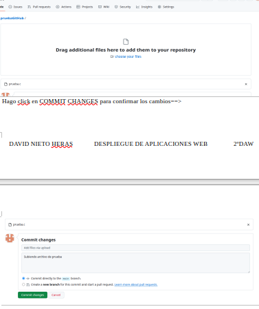

# Funciones de GitHub
**Autor:** David Nieto Heras
## Introducción
**GitHub** es una _plataforma web_ de alojamiento de código basada en la nube que permite a los desarrolladores almacenar, compartir y colaborar en proyectos de software utilizando el sistema de control de versiones Git.

En cuanto a sus **usos**, en GitHub podemos:
1. **Crear repositorios**: en GitHub podemos guardar nuestros proyectos atraves de los **repositorios**.
2. **Actualizar nuestro proyectos**: a traves de los COMMITS podemos ir confirmando los cambios y actualizando nuestros proyectos.
3. **Crear y adminsitrar ramas**: podemos crear varias ramas en nuestro repositorio.
5. **Colaborar con otros usuarios**: podemos colaborar con otros usuarios y dejar que modifiquen nuestro repositorio o trabajar en un proyecto juntos (cada uno puede tener su propia rama y luego fusionarlas). 

## Pasos a seguir
### Crear repositorios y guardar nuestros proyectos
Hago clic en NEW ==>  
  
Le pongo el nombre al repositorio y lo inicializo con README ==>  
  
Repositorio creado==>  
  
Subo archivos al repositorio (Add File -> Upload Files) ==>  
  
Arrastro el archivo y hago COMMIT ==>  
  
Repositorio con los cambios realizados ==>
 
#### Actualizar nuestros proyectos
Cade vez que hacemos un cambio en el repositorio hacemos un commit. Para acceder al historial de commits tenemos que:

 
