# Funciones de GitHub
**Autor:** David Nieto Heras
## Introducción
**GitHub** es una _plataforma web_ de alojamiento de código basada en la nube que permite a los desarrolladores almacenar, compartir y colaborar en proyectos de software utilizando el sistema de control de versiones Git.

En cuanto a sus **usos**, en GitHub podemos:
1. **Crear repositorios**: en GitHub podemos guardar nuestros proyectos atraves de los **repositorios**.
2. **Actualizar nuestro proyectos**: a traves de los COMMITS podemos ir confirmando los cambios y actualizando nuestros proyectos.
3. **Registrar los cambios**: en cada repositorio podemos acceder a historial un commits (todos los cambios realizados en el proyecto desde que se creo).
4. **Crear ramas y fusionarlas**: podemos crear varias ramas en nuestro repositorio. Estas ramas son utiles para la colaboración con otros usuarios o para trabajar en otra rama que no sea la principal. También podemos fusionar las ramas, introduciendo los cambios que hemos hecho en una rama a otra.
5. **Colaborar con otros usuarios**: podemos colaborar con otros usuarios y dejar que modifiquen nuestro repositorio o trabajar en un proyecto juntos (cada uno puede tener su propia rama y luego fusionarlas). 

## Pasos a seguir
### 1. Crear repositorios y guardar nuestros proyectos
Hago clic en NEW ==> 

 

Le pongo el nombre al repositorio, lo inicializo con README y creo el repositorio pulsando en Create repository==>

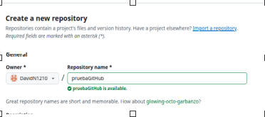  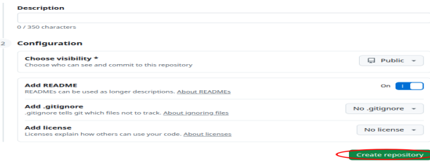  

Una vez con el repositorio creado, puedo subir archivos al repositorio (Add File -> Upload Files) ==>  

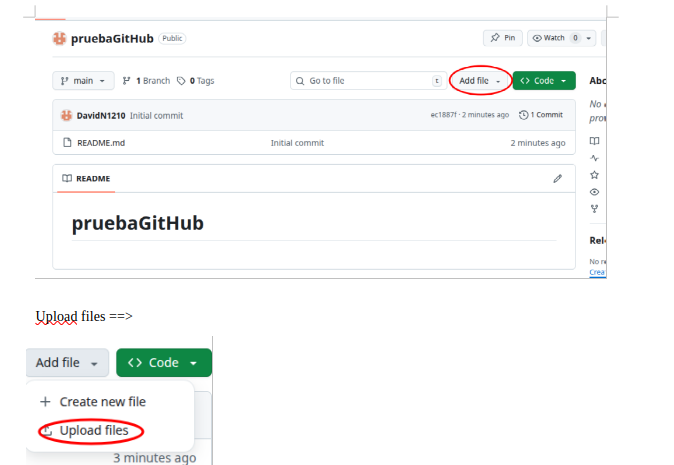  

Arrastro el archivo y hago COMMIT ==>  

Finalmente podemos ver el repositorio con los cambios realizados ==>  

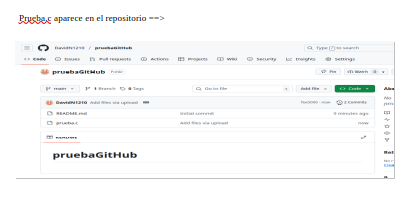  

### 2. Actualizar nuestros proyectos y acceder al registro de los cambios
Cada vez que hacemos un cambio en el repositorio hacemos un commit. Para acceder al historial de commits tenemos que hacer _click_ donde indica la imagen ==>  

Y ya podriamos ver el historial de commits ==>  

  

### 3. Crear y fusionar ramas  
Para crear una rama tenemos que abrir la pestaña de las ramas y hacer _click_ en **View all branches** ==>

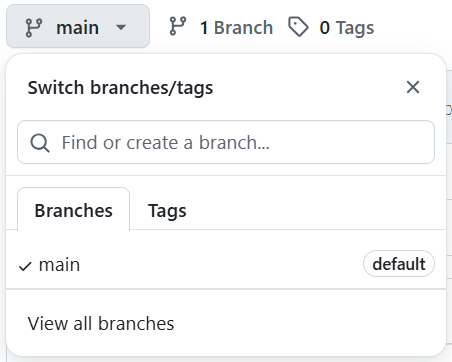 

En la nueva página pulsamos en **New branch** y creamos la rama ==> 

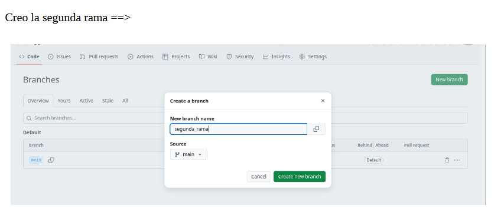  

Nueva rama creada ==>

Luego para fusionar una rama secundaria con la principal, tengo que hacer un cambio en la secundaria (segunda rama) para que me salga la opcion de hacer el pull request (Compare & Pullrequest) ==> 

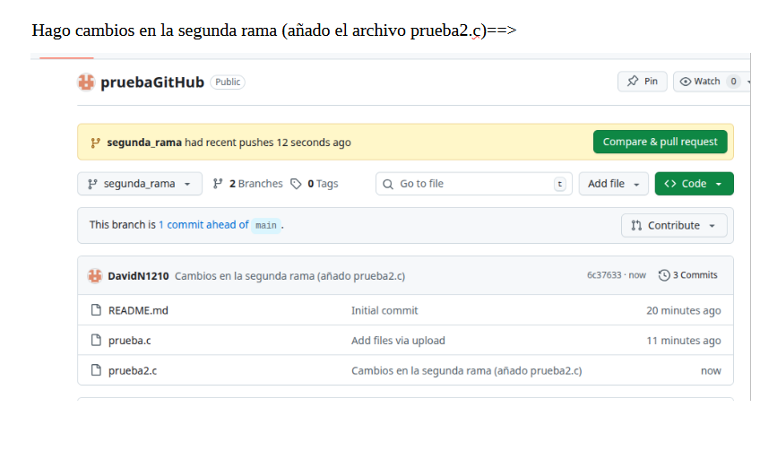 

Despues de pulsar en Compare & Pullrequest, creo el pull request ==>

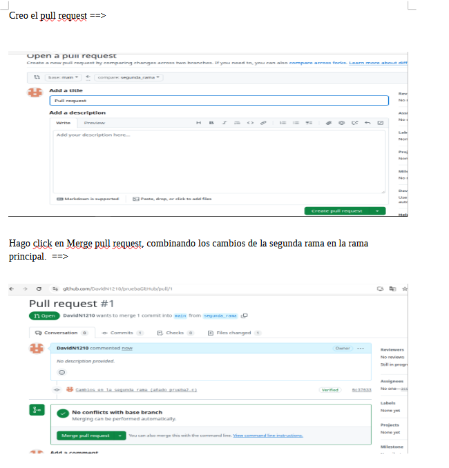  

Después de hacer click en Merge pull request, confirmo el merge y podemos ver que las la ramas se han fusionado y en el main se han hecho los cambios que he hecho en la rama secundaria anteriormente ==>

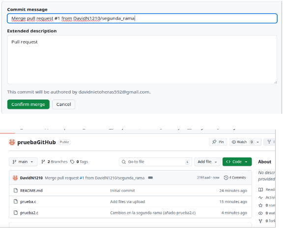

### 4. Colaborar con otros usuarios
Para añadir colaboradores a nuestro repositorio, tenemos que ir a Settings y hacer click en Collaborators==>

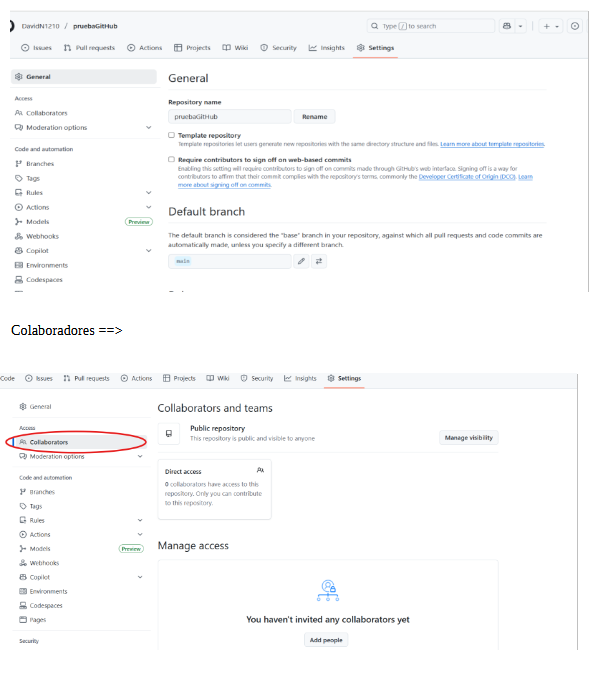

 Luego para añadir a los colaboredores pulsamos en Add people, buscamos al usuario de GitHub que queremos añadir y hacemos click en Add to repository para añadirlo en nuestro repositorio==>

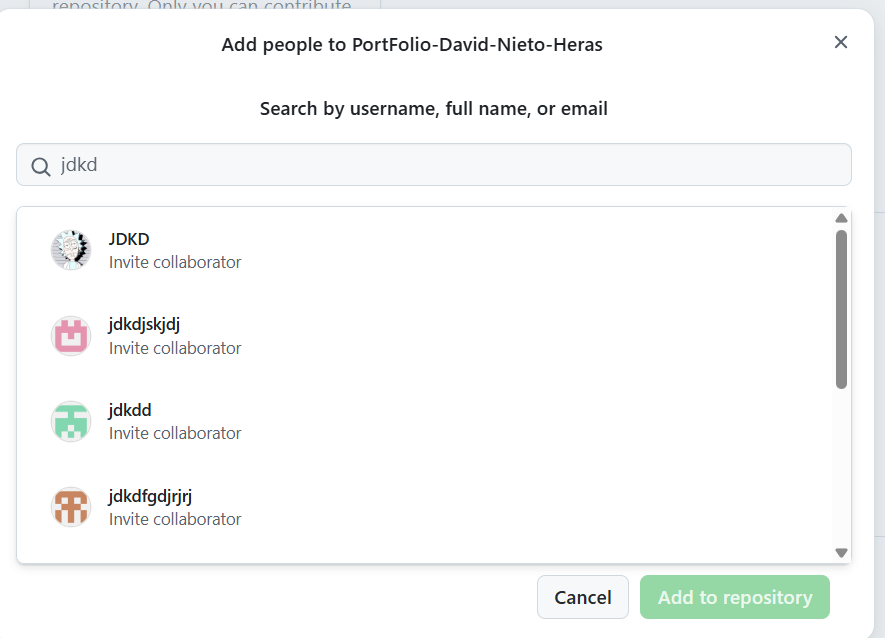
 
